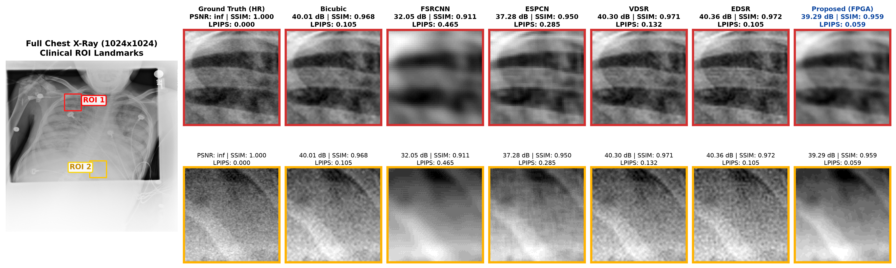

# Siêu Phân Giải Ảnh Y Tế Tăng Tốc FPGA

Compact SRCNN (1.649 tham số) triển khai trên Xilinx Zynq-7020 (PYNQ-Z2) với kiến trúc RTL bit-accurate,
phục vụ tác vụ siêu phân giải ảnh MRI / X-quang tại biên (Edge AI) với mức công suất dưới 1.5 W.

---

## 1. Bài Toán

Thiết bị chẩn đoán hình ảnh y tế tại biên (máy X-quang di động, đầu đọc MRI nhỏ gọn) bị ràng buộc
về ngân sách công suất và chi phí phần cứng, không thể tích hợp GPU datacenter.
Bicubic interpolation không phục hồi được cấu trúc cạnh mô mềm sau upsampling.

Dự án này triển khai mạng SRCNN thu nhỏ xuống 1.649 tham số, lượng hóa toàn bộ sang fixed-point Q7/S0.7,
và tổng hợp thành IP Core RTL (Verilog) chạy trực tiếp trên FPGA Zynq-7020.

---

## 2. Kết Quả Chính

### 2.1. Chất Lượng Ảnh — PYNQ-Z2, 2.200 ảnh y tế (NIH CXR + Chest X-ray)

| Hệ số phóng to | PSNR (dB) | SSIM | MS-SSIM | LPIPS (thấp = tốt) | Latency Conv (ms) |
| :---: | :---: | :---: | :---: | :---: | :---: |
| 2x | 39.29 | 0.9594 | 0.9962 | 0.0752 | 12.7 |
| 3x | 38.27 | 0.9426 | 0.9915 | 0.1460 | 12.8 |
| 4x | 36.00 | 0.9284 | 0.9873 | 0.2052 | 12.7 |

Giao thức: 10 lần warm-up, thống kê Mean qua 2.200 ảnh trên bo mạch thực.

### 2.2. So Sánh Hiệu Năng Đa Nền Tảng (Scale 2x)

| Nền tảng | Kiểu dữ liệu | Latency E2E (ms) | Công suất (W) | FPS/W |
| :--- | :---: | :---: | :---: | :---: |
| **Xilinx PYNQ-Z2 (Zynq-7020 FPGA)** | S7.0 / S0.7 | 444.19 ± 0.52 | **1.44** | **1.56** |
| NVIDIA Tesla T4 (GPU CUDA 12.2) | Float32 | 18.53 ± 0.15 | 35.00 | 1.54 |
| Apple M1 — CPU | Float32 | 273.59 ± 128.20 | 11.50 | 0.32 |
| Apple M1 — MPS GPU | Float32 | 21.90 ± 2.75 | 11.50 | 3.97 |
| Intel Xeon Platinum 8259CL (4 vCPU) | Float32 | 98.45 ± 2.45 | 65.00 | 0.16 |

FPGA đạt hiệu quả năng lượng tương đương GPU datacenter Tesla T4 ở mức công suất thấp hơn 24 lần.
Độ lệch chuẩn latency chỉ ±0.52 ms — không có jitter do OS scheduler.

### 2.3. Xác Nhận Bit-Accurate

```
|I_FPGA - I_Golden| == 0  (4/4 kịch bản DV: Functional 4x4, Patch 128x128, Full Image 1024x1024, Multi-Image)
```

### 2.4. So Sánh Định Tính



---

## 3. Kiến Trúc Hệ Thống

```
[Ảnh đầu vào LR]
       |
  Bicubic Upsample (CPU host, 1 lần)
       |
  [Compact SRCNN RTL IP Core — Zynq-7020 PL]
  |  Conv Layer 1: (1->16, 9x9) + ReLU  |   Trọng số: S0.7 (8-bit)
  |  Conv Layer 2: (16->8, 1x1) + ReLU  |   Pixel:    S7.0 (8-bit)
  |  Conv Layer 3: (8->1,  5x5)         |   Acc:     S24.7 (32-bit)
       |
  [Ảnh đầu ra SR — trực tiếp từ PL]
```

Tổng tham số: 1.649 (1.624 trọng số + 25 bias).
Trọng số cố định: `core_project/hardware_fpga/weights_fixed_point/weights_hex_clean.txt`

---

## 4. Yêu Cầu Môi Trường

**Phần cứng**: Bo mạch Xilinx PYNQ-Z2 (Zynq-7020 SoC, 512 MB DDR3, microSD boot), kết nối Ethernet hoặc USB-UART.

**Phần mềm**: Python >= 3.9, PyTorch >= 2.0, Typst (để biên dịch báo cáo PDF).

---

## 5. Thiết Lập Môi Trường

```bash
git clone https://github.com/Kisukabe/AI-Based-Image-Super-Resolution.git
cd AI-Based-Image-Super-Resolution

# Tạo môi trường Conda
conda env create -f environment.yml
conda activate srcnn-fpga

# Hoặc cài thẳng từ requirements.txt
pip install -r requirements.txt
```

---

## 6. Ba Workflow Chính

### Kiểm chứng vi mạch Bit-Accurate DV

```bash
python3 scripts/run_dv_verification.py --scenario functional   # Kịch bản 1: Functional 4x4
python3 scripts/run_dv_verification.py --scenario patch        # Kịch bản 2: Patch 128x128
python3 scripts/run_dv_verification.py --scenario testset      # Kịch bản 3: Full image 1024x1024
python3 scripts/run_dv_verification.py --scenario all          # Tất cả 4/4 kịch bản
# Expected: ALL_PASS | max_abs_error = 0
```

### Đo hiệu năng đa nền tảng

```bash
python3 scripts/run_multi_platform_benchmark.py
# Kết quả: core_project/benchmarks_reports/multi_platform/
```

### Tái tạo hình ảnh bài báo IEEE 300 DPI

```bash
python3 scripts/run_generate_paper_figures.py
# Sinh Fig 7 (Overlap-Tiling Ablation) và Fig 8 (So sánh định tính 7 mô hình)
# Kết quả: figures/
```

### Xuất báo cáo kỹ thuật PDF

```bash
./build_pdf.sh          # Xuất requirements/BAO_CAO_NHIEM_VU.pdf (3 trang)
./build_pdf.sh 1        # Xem trước Trang 1 (PDF + PNG)
./build_pdf.sh watch    # Hot-reload tự động khi Cmd+S (< 0.03s)
```

---

## 7. Cấu Trúc Thư Mục

```text
AI-Based-Image-Super-Resolution/
├── AGENTS.md                               # Workspace memory & chỉ dẫn hệ thống
├── build_pdf.sh                            # Script biên dịch Typst -> PDF
├── requirements.txt / environment.yml      # Thư viện Python / Conda
│
├── core_project/                           # Mã nguồn cốt lõi (bảo toàn nguyên vẹn)
│   ├── ai_software/                        # PyTorch models, training, evaluation, checkpoints
│   ├── hardware_fpga/                      # Verilog RTL, testbench, weights fixed-point, DV
│   ├── benchmarks_reports/                 # Logs PYNQ-Z2, multi-platform, deliverables excel
│   └── data/                              # Dataset ảnh y tế (HR 1024x1024, LR 512x512)
│
├── requirements/                           # Hồ sơ yêu cầu & báo cáo kỹ thuật
│   ├── TASK_ROADMAP.md                     # Ma trận tiến độ 12 hạng mục
│   ├── BAO_CAO_NHIEM_VU.pdf                # Báo cáo xuất bản chính thức
│   ├── BAO_CAO_NHIEM_VU.typ                # File master Typst
│   └── report_pages/                       # Module Typst từng trang
│
├── figures/                                # Hình ảnh 300 DPI cho bài báo IEEE
├── scripts/                                # Script điều phối (DV, benchmark, figures)
├── docs/                                   # Tài liệu kỹ thuật phụ trợ
├── legacy_experiments/                     # Thử nghiệm cũ (RGB models, Kaggle notebooks)
└── Medical_SR_hardware_paper/              # Bản thảo bài báo IEEE GTSD 2026
```

---

## 8. Bảng Tham Chiếu Biến Thể SRCNN

| Biến thể | Kiến trúc Conv | Số tham số | Kiểu dữ liệu | Vị trí | Vai trò |
| :--- | :---: | :---: | :---: | :--- | :--- |
| **Compact SRCNN (Hardware)** | 1->16->8->1 | **1.649** | S7.0/S0.7 (RTL) | `core_project/hardware_fpga/weights_fixed_point/` | Kiến trúc lõi chạy trên FPGA PYNQ-Z2 |
| SRCNN Original (Baseline) | 1->64->32->1 | 8.129 | Float32 | `core_project/ai_software/models/` | Baseline đối chứng |
| SRCNN RGB (Legacy) | 3->64->32->3 | 69.251 | Float32 | `legacy_experiments/weight_models_rgb/` | Thử nghiệm đa kênh trên Kaggle |

---

## 9. Tài Liệu Tham Khảo

- Bài báo: *Hardware-Accelerated Medical Image Super-Resolution on Xilinx Zynq-7020 FPGA*, IEEE GTSD 2026
  (đang chuẩn bị nộp, bản thảo tại `Medical_SR_hardware_paper/GTSD2026-193-IEEE/`)
- Dong et al., *Learning a Deep Convolutional Network for Image Super-Resolution*, ECCV 2014
- NIH Chest X-ray Dataset (Wang et al., 2017): 112.120 ảnh X-quang ngực
